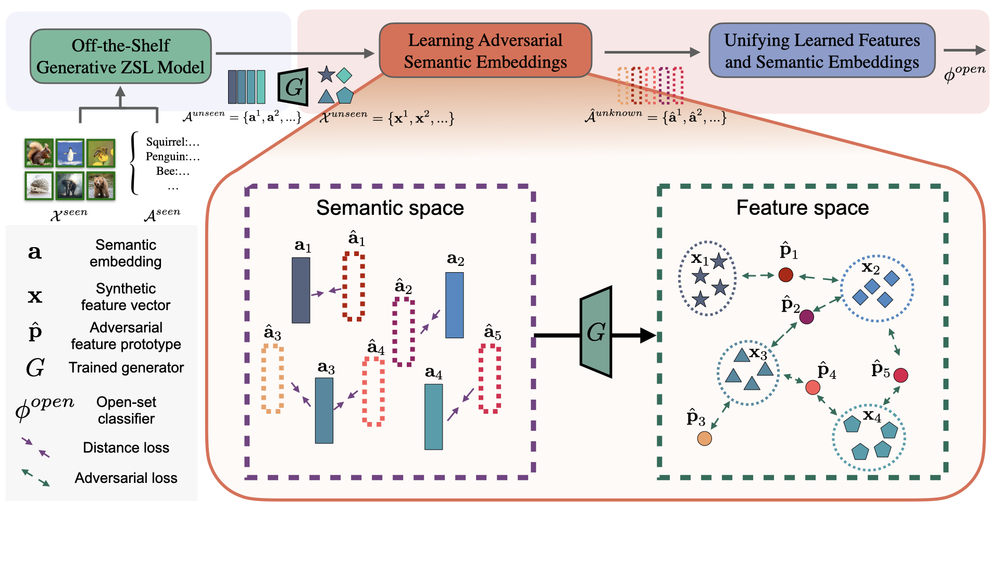

# Zero-Shot Open-Set Recognition with Adversarial Semantic Embeddings

Zero-Shot Learning (ZSL) focuses on classifying samples of **unseen classes** with only their side semantic information presented during training. It cannot handle real-life, open-set scenarios where there are test samples of **unknown classes** for which neither samples (\eg, images) nor their side semantic information is known during training. Open-Set Recognition (OSR) is dedicated to addressing the unknown class issue, but existing OSR methods are not designed to model the semantic information of the unseen classes. To tackle this joint ZSL and OSR problem, we propose a new yet important task dubbed ”Zero-Shot Open-Set Recognition” (ZS-OSR), where a model is trained under the ZSL setting but it is required to accurately classify samples from the unseen classes while being able to reject samples from the unknown classes during inference. We establish the performance benchmark of this new task by combining existing state-of-the-art ZSL and OSR models to perform the ZS-OSR task on four widely used datasets adapted from the ZSL task, and reveal that these simply combined solutions perform badly in distinguishing the unseen-class and the unknown-class samples. We further introduce a novel approach specifically designed for ZS-OSR, in which our model learns to generate adversarial semantic embeddings of the unknown classes to train an unknowns-informed open-set classifier. Extensive empirical results show that our method substantially outperforms the combined solutions in detecting the unknown classes without degrading the classification accuracy on the unseen classes.

## Overall Architecture



## Installation

Two environments need to be prepared, one for the training of TFVAEGAN and the other for the training of ASE.

For TFVAEGAN: (from [the official Pytorch implementation](https://github.com/akshitac8/tfvaegan) )

```bash
conda create -n tfvaegan python=3.6
conda activate tfvaegan
pip install https://download.pytorch.org/whl/cu90/torch-0.3.1-cp36-cp36m-linux_x86_64.whl
pip install torchvision==0.2.0 scikit-learn==0.22.1 scipy==1.4.1 h5py==2.10 numpy==1.18.1
```

For ASE:

```bash
conda create -n ASE python=3.8
conda activate ASE
pip install -r requirements.txt
```


## Data preparation

1. Download ZSL datasets

Download CUB, AWA2, FLO and SUN features and attribute vectors from the drive link below (copy from  [the official Pytorch implementation of TFVAEGAN](https://github.com/akshitac8/tfvaegan) ) :

```
link: https://drive.google.com/drive/folders/16Xk1eFSWjQTtuQivTogMmvL3P6F_084u?usp=sharing
```

Extract them in the `datasets` folder.

2. Extend datasets to ZS-OSR:

```bash
conda activate ASE
python datasets/generate_attribute_split.py
```

## TFVAEGAN training

Training TFVAEGAN models for four datasets

```bash
conda activate tfvaegan
python scripts/TFVAEGAN_train/run_cub_tfvaegan.py
python scripts/TFVAEGAN_train/run_awa_tfvaegan.py
python scripts/TFVAEGAN_train/run_flo_tfvaegan.py
python scripts/TFVAEGAN_train/run_sun_tfvaegan.py
```

The trained model will be saved in the  `output` folder.

## ZS-OSR evaluation

 `[Method]=[Openmax, Placeholder, Energy, ODIN, LogitNorm, MaxLogit, ASE] `.

 `[Dataset]=[CUB, AWA2, FLO, SUN] `. 

To evaluate ZS–OSR performace of a method on a specific dataset, run:

```bash
conda activate ASE
python scripts/[Method]/[Dataset]_[Method].py
```

To evaluate generalized ZS-OSR performance of a method on a specific dataset, run:

```bash
conda activate ASE
python scripts/[Method]/[Dataset]_[Method]_gzsl.py
```

For example, to evaluate ZS-OSR and generalized ZS-OSR performance of our method ASE on the dataset FLO respectively, run:

```bash
conda activate ASE
python scripts/ASE/FLO_ASE.py
python scripts/ASE/FLO_ASE_gzsl.py
```

The performance of method MSP is shown together with ASE.

## Acknowledgements
[TF-VAEGAN](https://github.com/akshitac8/tfvaegan) provides a ZSL framework.
